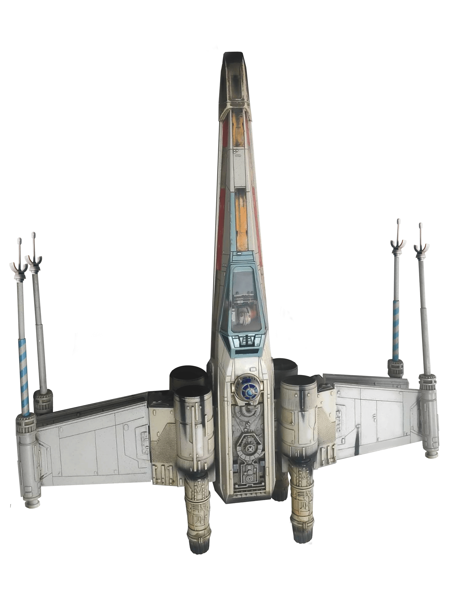

# Alien DOM Invader

Alien DOM Invader is an interactive Chrome extension game that turns any webpage into a battlefield. Control a spaceship and destroy DOM elements on any website, transforming your browsing experience into an exciting arcade game.

## Game Description

In Alien DOM Invader, you pilot a spaceship across any webpage, shooting at and destroying DOM elements like buttons, images, links, and more. The game overlays on top of any website without affecting its functionality, allowing you to play while browsing.

### Features

- **Time Attack Mode**: Score as many points as possible in 60 seconds
- **Power-ups**: Collect different power-ups to enhance your spaceship's abilities:
  - **Rapid Fire**: Shoot 4x faster
  - **Spread Shot**: Fire 3 projectiles at once
  - **Shield**: Temporary invincibility
  - **Nuke**: One-time use per game to clear all elements on screen
- **Interactive Elements**: Website elements like headers and navigation bars can shoot back with projectiles
- **Moving Targets**: Some elements move around, making them harder to hit but worth more points
- **Visual Effects**: Pulse waves, explosions, and projectile trails enhance the visual experience

## Installation Instructions

### Installing from GitHub

1. Visit the GitHub repository at [https://github.com/vvantruong/x-dom-invader](https://github.com/vvantruong/x-dom-invader)
2. Click the green "Code" button and select "Download ZIP"
3. Extract the ZIP file to a location on your computer

### Installing as an Unpacked Chrome Extension

1. Open Chrome and navigate to `chrome://extensions/`
2. Enable "Developer mode" by toggling the switch in the top right corner
3. Click "Load unpacked" and select the extracted folder containing the extension
4. The Alien DOM Invader extension should now be installed and visible in your extensions list

## How to Play

1. Navigate to any website
2. Click the Alien DOM Invader extension icon in your browser toolbar
3. Click "Start Invasion" in the popup
4. Use the arrow keys to move your spaceship
5. Press the spacebar to shoot
6. Press B to use your one-time Nuke ability
7. Destroy as many elements as possible before time runs out
8. Click the "?" button in the top right to view the game guide

### Controls

- **Arrow Keys**: Move the spaceship
- **Spacebar**: Shoot
- **B Key**: Deploy Nuke (one-time use per game)
- **Alt+D**: Toggle debug mode (shows targetable elements)

## Enemy Types

- **Orange Projectiles**: Track your spaceship's movements
- **Red Projectiles**: Move faster in straight lines

## Development

The game is built using vanilla JavaScript and utilizes the Chrome Extensions API to interact with web pages. It creates canvas elements for rendering the game and uses DOM manipulation to identify targetable elements.

## Credits

- Game concept and development: [Your Name]
- Sound effects: [Source]
- Spaceship image: [Source]

## License

MIT